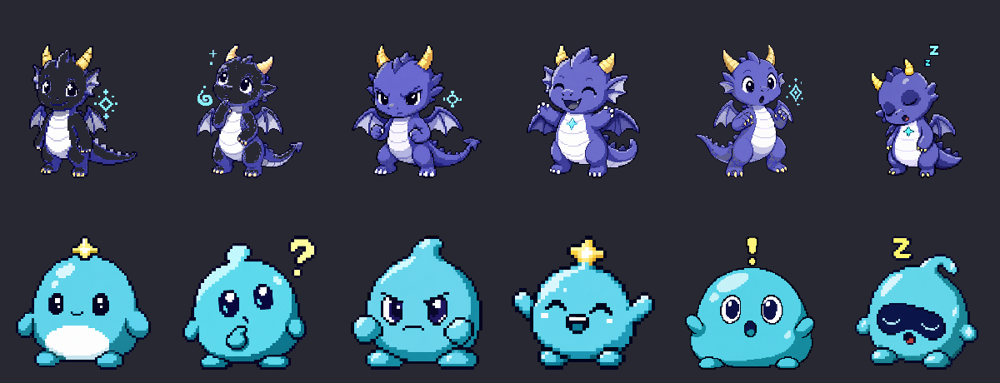

# Clawpet

A pixel-art desktop companion for [OpenClaw](https://openclaw.ai). Your AI assistant gets a face: a small dragon (Dawn), slime (Pip), or any Clawpet you generate. Reacts to what OpenClaw is doing — thinking, working, alert, done — and quietly idles the rest of the time.

> **Status:** v0.4, working end-to-end on Windows + macOS + Linux over **Tailscale**. Bring your own OpenClaw.



## What it actually is

Three pieces working together:

1. **A tiny local HTTP runtime** (`Hono` on Node, default `127.0.0.1:8737`) that holds the avatar's state.
2. **A transparent always-on-top desktop overlay** (Tauri 2 + React + Vite) that polls the runtime and animates a pixel-art sprite for each state.
3. **An OpenClaw skill + daemon** (`clawpet`) that tails OpenClaw's real session stream and sends state updates to the runtime.

The avatar lives on **your desktop**. OpenClaw can run on the same machine, on your home server, or anywhere on your tailnet — whichever is convenient.

### Why Tailscale matters right now

The current cross-machine path is **Tailscale-first**. That's deliberate: most OpenClaw users run OpenClaw on a Linux box/server but want the pet on their daily-driver laptop or desktop. Tailscale gives Clawpet a private, encrypted, stable hostname like `<desktop-host>.<tailnet>.ts.net` without exposing a public port or building a cloud relay. Localhost works for same-machine setups; Tailscale is the recommended path for everything else.

## Quickstart: try it locally first (≈60 seconds)

You need: **Node.js ≥ 20**, **git**, and (for the desktop window) **Rust + a C++ build toolchain**.

Install on the machine that should display the avatar:

```bash
# macOS / Linux
curl -fsSL https://raw.githubusercontent.com/fighterz8/clawpet/main/scripts/install-unix.sh | bash
```

```powershell
# Windows (PowerShell)
irm https://raw.githubusercontent.com/fighterz8/clawpet/main/scripts/install-windows.ps1 | iex
```

Try the pet before connecting OpenClaw:

```bash
# terminal 1 — runtime demo mode
cd ~/clawpet && CLAWPET_DEMO=1 npm run runtime:dev

# terminal 2 — desktop overlay
npm run desktop:dev
```

`CLAWPET_DEMO=1` cycles through idle → thinking → focused → happy → alert → sleepy every 6 seconds. No OpenClaw pairing required.

## Cross-machine setup

Use this when OpenClaw runs on one machine and the avatar displays on another. Tailscale is recommended.

On the machine displaying the avatar, bind the runtime to the Tailscale-reachable interface:

```bash
CLAWPET_RUNTIME_HOST=0.0.0.0 CLAWPET_RUNTIME_PORT=8737 npm run runtime:dev
```

Then pair from the OpenClaw host using the target's Tailscale hostname:

```bash
clawpet pair --code 472091 --host <desktop-host>.<tailnet>.ts.net:8737
```

> Loopback (`127.0.0.1`) is trusted; non-loopback/Tailscale requires a bearer token. The token is auto-generated on first boot at `~/.openclaw/clawpet/runtime-token` (mode `0600`) and is normally transferred via the 6-digit pair flow below.

### 1. On the OpenClaw side

Install the skill (one-time):

```bash
git clone https://github.com/fighterz8/clawpet ~/clawpet 2>/dev/null || true
mkdir -p ~/.openclaw/skills
ln -sf ~/clawpet/skills/clawpet ~/.openclaw/skills/clawpet 2>/dev/null \
  || ln -sf ~/clawpet/skills/clawpet ~/.openclaw/workspace/skills/clawpet
```

### 2. Pair the two machines (Plex/Spotify-style 6-digit code)

On the **target** (the machine running the avatar), open a pair window:

```bash
clawpet pair-mode
```

It prints a banner with a 6-digit code:

```
  ┌─────────────────────────────────────────────┐
  │   Pair code:    472 · 091                   │
  │   Runtime:      http://127.0.0.1:8737       │
  │   Expires in:   90 s                        │
  └─────────────────────────────────────────────┘

  On your OpenClaw machine, run:
    clawpet pair --code 472091 --host <this-machine-hostname>:8737
```

On the **OpenClaw machine**, run that command. The runtime rotates the bearer token, sends it back over the same connection, and the CLI saves it to `~/.openclaw/clawpet/config.json`. Pair window closes automatically. No copy-pasting tokens, no editing config files.

> Security: 90-second window, 3 attempts before lockout, 1-second rate limit, timing-safe comparison, public endpoint never reveals the code, returns 404 (not 401) once closed so external scanners can't fingerprint state.

Verify:

```bash
clawpet ping     # public — runtime alive?
clawpet status   # authed — current state + paired source
clawpet send happy "It works" --bubble "Hello! 🐲" --quiet
```

### 3. Start the live tracker daemon (recommended)

This is what makes Dawn actually feel alive — a sidecar that tails OpenClaw's session log and mirrors what the assistant is currently doing in real time, with **zero LLM involvement and zero token cost**:

```bash
clawpet daemon start    # starts in background, logs to ~/.openclaw/clawpet/daemon.log
clawpet daemon status   # check it's running
clawpet daemon stop
```

The daemon watches `~/.openclaw/agents/main/sessions/<id>.jsonl`, the structured event stream OpenClaw writes for every turn. It maps tool calls → `focused`, errors → `alert`, completion → `happy`, etc. With the daemon running, the avatar reacts continuously and accurately throughout your conversation. The semantic emit commands (next section) are still useful for the LLM to express explicit beats, but the daemon handles the heavy lifting on its own.

## How OpenClaw drives the avatar

There are **two layers**, in order of priority:

**Layer 1 — the daemon (automatic, free).** Tails the session JSONL, emits states for every tool call / error / completion. No model involvement.

**Layer 2 — semantic emits from the LLM (optional flavor).** Two CLI verbs:

| Command | Use it for |
| ------- | ---------- |
| `clawpet react <event>` | Semantic, user-gated. Preferred. |
| `clawpet send <state>`  | Direct state push. Manual cases. |

Reaction events:

| Event | Maps to | Fires at activity ≥ |
| ----- | ------- | ------------------- |
| `tool-error` / `blocker` / `done` | `alert` / `alert` / `happy` | `minimal` |
| `long-task` / `thinking`          | `focused` / `thinking`      | `balanced` |
| `user-message` / `tool-start`     | `thinking` / `focused`      | `balanced` / `expressive` |
| `heartbeat`                       | `thinking`                  | separate flag |

Activity is set by the **user**, not the LLM:

```bash
clawpet activity off          # silent
clawpet activity minimal      # errors + completion only
clawpet activity balanced     # default
clawpet activity expressive   # also reacts to your messages and tool starts
clawpet activity maximum      # reserved for richer per-tool reactions

clawpet heartbeat-reactions on   # default off; opt-in flash during heartbeat polls
```

The CLI itself enforces the gate. If the LLM tries to emit something your level forbids, the call returns `{ ok: true, suppressed: true }` and nothing fires.

## Cost discipline

Emits are tiny HTTP POSTs — the only cost is the LLM tool call that issues them. With `--quiet`, expect:

| Activity      | Typical extra tokens / active turn |
| ------------- | ---------------------------------- |
| `off`         | 0                                  |
| `minimal`     | 0–80                               |
| `balanced`    | 0–200                              |
| `expressive`  | 100–400                            |
| `maximum`     | 200–600                            |

## Decay rules

The runtime computes effective state lazily on every read. No timers, no LLM cost.

- **Active states (`thinking`, `focused`, `alert`) persist forever** until a new event arrives. The avatar reflects what OpenClaw is *currently* doing, not what it did 8 seconds ago.
- **`happy` is terminal** — it lingers 8s after being set, then reverts to `idle`. (Configurable via `terminalLingerMs`.)
- **`idle` drifts to `sleepy` after 5 minutes** of no events. (Configurable via `sleepyAfterMs`.)
- **Bubbles track the current effective state.** Active/terminal states keep their useful caption (`Thinking…`, `Working on tests…`, `Done!`) until another event replaces it. When terminal `happy` decays back to `idle`, the stale work caption is replaced with the simple bubble text `idle` after 8s.

## Multi-avatar

Bundles live under `public/avatars/<name>-v<n>/`:

```
public/avatars/
├── dawn-v0/         # baby dragon
│   ├── avatar.json
│   └── assets/{idle,thinking,focused,happy,alert,sleepy}.png
└── pip-v0/          # cyan slime — proves the multi-avatar pipeline
    ├── avatar.json
    └── assets/{idle,thinking,focused,happy,alert,sleepy}.png
```

Switch which avatar the runtime serves:

```bash
CLAWPET_AVATAR_BUNDLE=pip-v0 npm run runtime:dev
```

The desktop overlay reads the matching bundle automatically. Build-time override:

```bash
VITE_CLAWPET_AVATAR_BUNDLE=pip-v0 npm run desktop:dev
```

### Generating a new Clawpet

Every new sprite must follow [`docs/clawpet-style-guide.md`](docs/clawpet-style-guide.md) v1: pixel-art, 128×128 logical / 512×512 export, transparent background, limited palette, hard 1-px outline, cel shading, six required states (idle / thinking / focused / happy / alert / sleepy).

The exciting part: the pet can be generated from **your OpenClaw's identity** — its name, `SOUL.md`, persona notes, and preferred creature/vibe. Dawn is the reference baby-dragon assistant familiar used by this repo. Pip is a second generated bundle proving the pipeline isn't hardcoded to one mascot. The locked prompt template in §7 keeps those personalized pets visually coherent instead of becoming random one-off art.

## Architecture

```
┌──────────────────────┐                 ┌──────────────────────────┐
│  OpenClaw session    │   tool call     │  ~/clawpet/skills/       │
│  (any machine)       ├────────────────▶│  clawpet/bin/clawpet.mjs │
└──────────────────────┘                 └─────────────┬────────────┘
                                                       │ HTTP POST + Bearer
                                                       ▼
┌────────────────────────────────────────────────────────────────────┐
│  Target machine                                                    │
│                                                                    │
│  ┌─────────────────────┐   in-mem state    ┌────────────────────┐  │
│  │  Hono runtime       │◀──────────────────│  state store       │  │
│  │  /health /status    │                   │  + decay-on-read   │  │
│  │  /avatar/state      │                   └────────────────────┘  │
│  │  /admin/rotate-token│              ▲                            │
│  └─────────────────────┘              │ /status (poll, loopback)   │
│                                       │                            │
│                                ┌──────┴───────────┐                │
│                                │  Tauri overlay   │                │
│                                │  React + Vite    │                │
│                                │  PNG bundle      │                │
│                                └──────────────────┘                │
└────────────────────────────────────────────────────────────────────┘
```

**Auth model:**

- `127.0.0.1` (loopback): trusted, no token needed. Local desktop overlay always works.
- Anything else (LAN / Tailscale / `0.0.0.0`): token required on every request except `GET /health`, `GET /pair-mode`, and `POST /pair/claim` (the last two are public *only* while pair mode is active).
- Token lives at `~/.openclaw/clawpet/runtime-token` and can be rotated:
  - In-place from a paired client: `clawpet rotate-token`.
  - From scratch via the magic-pair flow: `clawpet pair-mode` on the target, `clawpet pair --code … --host …` on the OpenClaw side. This is also the only way to recover from a lost token without ssh access to the target.

## Documentation

- [`docs/clawpet-style-guide.md`](docs/clawpet-style-guide.md) — locked visual style for all Clawpets (v1).
- [`docs/avatar-bundle-spec.md`](docs/avatar-bundle-spec.md) — bundle manifest schema.
- [`docs/avatar-event-contract.md`](docs/avatar-event-contract.md) — runtime event format.
- [`docs/runtime-first-mvp-plan.md`](docs/runtime-first-mvp-plan.md) — the runtime-first pivot rationale.
- [`docs/roadmap.md`](docs/roadmap.md) — near-term, mid-term, and speculative directions.
- [`docs/adr/`](docs/adr/) — architecture decision records.

## Status & non-goals

**Working:** transparent draggable overlay, system tray, six-state pixel sprites (Dawn pack v0.4.0 with proportion/palette-coherent regen of `idle` and `thinking`), runtime auth, lazy state decay with sticky bubbles, semantic reactions, activity gating, heartbeat opt-in, **Plex/Spotify-style 6-digit pair flow**, **session-JSONL daemon for automatic real-time reactivity**, Tailscale-native cross-machine projection, multi-avatar bundles.

**Not yet:**
- Signed binary releases (currently install via `git + npm + tauri`).
- OpenClaw-hosted relay for users without Tailscale.
- Native idle animation (frame loops within a state) — bigger "feels alive" jump.
- Environment / screen awareness — see [roadmap](docs/roadmap.md).

**Will not:** ambient cloud spend without a setting; surveillance-y always-on capture; closed paid avatar packs.

## License

Source: MIT. Avatar art bundles: see each `avatar.json` (Dawn and Pip are CC-BY-NC-4.0).
