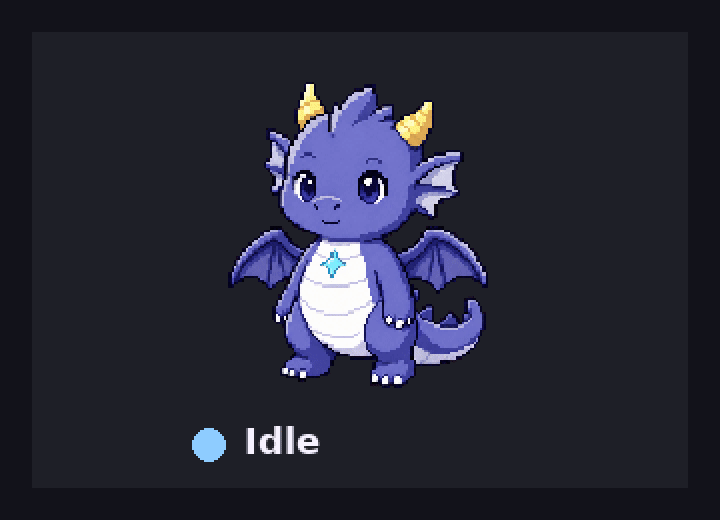

# Clawpet

Clawpet is a local-first desktop companion for [OpenClaw](https://openclaw.ai). It gives your assistant a visible little body on the desktop — then keeps that pet in sync with what OpenClaw is actually doing: reading, thinking, working, waiting, celebrating, or asking for help.

Today the core experience is:
- a native desktop app with setup + tray controls
- a local runtime that owns pet state
- OpenClaw pairing over a simple 6-digit code
- authenticated reconnection after first pair
- runtime-driven avatar switching
- animated avatar bundles with per-state frame loops
- a sidecar daemon that mirrors real OpenClaw activity with near-zero token cost

> **Status:** active v0.5-era development. The desktop app/runtime path, pairing flow, animated Dawn bundles, and secondary showcase character are working.



---

## What Clawpet is for

Most assistants live in chat. Clawpet gives that assistant a persistent, ambient presence on the machine you actually look at.

That means:
- you can glance at the pet and tell whether OpenClaw is idle, thinking, focused, happy, alert, or sleepy
- your assistant can feel more personal without turning into noisy UI spam
- avatar changes can be driven conversationally by OpenClaw instead of by manual file editing on the display machine

Clawpet is meant to feel lightweight, local, and a little magical — not like a surveillance widget or a cloud tax.

---

## The important boundary

OpenClaw can manage almost everything **after the desktop app exists and is running**.

### The human / display machine must do

1. download or install Clawpet on the machine where the pet should appear
2. open the app at least once
3. if needed, show the pair code to OpenClaw

### OpenClaw can do the rest

- claim the 6-digit pair code
- store and reuse the auth token
- verify connection/auth readiness
- send test states and status bubbles
- start/stop/check the daemon on the OpenClaw host
- push and switch avatar bundles
- rotate tokens or re-pair when necessary
- drive day-to-day pet reactions automatically

So the intended story is:

**open the local app once → pair once → let OpenClaw handle the ongoing pet behavior**

---

## Normal user flow

1. Open Clawpet on the display machine.
2. If it was already paired before, just start chatting with OpenClaw.
3. If first-time setup is needed, or reconnect looks broken, click **Show pair code**.
4. Give that code + host to OpenClaw.
5. OpenClaw pairs, verifies auth, starts the daemon if appropriate, and sends a test ping.
6. Setup shows **Connected — setup complete**.
7. Close setup. The pet stays available via the tray.

---

## Connection status light

The floating overlay includes a small status dot near the edge of the invisible window so it stays visible instead of getting hidden behind the pet sprite.

- 🟢 **Green** — runtime is connected and OpenClaw auth is ready
- 🟡 **Yellow** — runtime is reachable, but OpenClaw is not fully ready/authenticated yet
- 🔴 **Red** — runtime offline/unreachable problem

In practice:
- green means "you’re good"
- yellow usually means "pair again or wait for OpenClaw to reconnect"
- red means "the runtime/app is down or not reachable"

---

## Returning users

Usually you do **not** need a new pair code.

The runtime persists its token locally at:

- `~/.openclaw/clawpet/runtime-token`

OpenClaw stores the matching token in:

- `~/.openclaw/clawpet/config.json`

So reopening Clawpet and chatting with OpenClaw should normally reconnect automatically.

Use a new pair code only when:
- this is first-time setup
- the status dot stays yellow and the pet does not respond
- tokens were rotated
- runtime/app data was cleared
- a dev rebuild or reset invalidated the saved runtime token

---

## Downloads

Clawpet is moving toward a simple download-first install flow surfaced from the landing page.

### Current package source

GitHub Actions workflow:
- `desktop-build.yml`
- <https://github.com/fighterz8/clawpet/actions/workflows/desktop-build.yml>

### Current artifact names

- **Windows:** `clawpet-windows` → `.exe` and `.msi`
- **macOS:** `clawpet-macos` → `.dmg` and `.app`
- **Linux:** `clawpet-linux` → `.AppImage`, `.deb`, and `.rpm`

Until stable release-package URLs are wired in, the landing page download buttons point to the current desktop-build workflow instead of dead placeholder routes.

For normal users, the desired path is:
- download the packaged desktop build for your OS
- open the app once
- let OpenClaw handle pairing and ongoing control

---

## Development quickstart

Packaged downloads are the target user flow. For development, run Clawpet from source on the display machine.

### Requirements

- Node.js 20+
- git
- Rust + platform build tools for Tauri
- Tailscale for cross-machine display/OpenClaw setups

### Install helpers

```bash
# macOS / Linux
curl -fsSL https://raw.githubusercontent.com/fighterz8/clawpet/main/scripts/install-unix.sh | bash
```

```powershell
# Windows PowerShell
irm https://raw.githubusercontent.com/fighterz8/clawpet/main/scripts/install-windows.ps1 | iex
```

### Run from source

```bash
cd ~/clawpet
npm ci
npm run desktop:dev
```

In the current v0.5 development path, the Tauri app starts the native local runtime.

The older Node runtime remains available for testing via:

```bash
CLAWPET_USE_NODE_RUNTIME=1 npm run desktop:dev
```

Or directly:

```bash
npm run runtime:dev
```

---

## Pairing from OpenClaw

Setup displays a command like:

```bash
clawpet wizard openclaw --code 472091 --host <desktop-host>.<tailnet>.ts.net:8737
```

Manual equivalent from the OpenClaw host:

```bash
clawpet pair --code 472091 --host <desktop-host>.<tailnet>.ts.net:8737
clawpet activity balanced
clawpet heartbeat-reactions off
clawpet daemon enable
# or: clawpet daemon start
```

### Verify from OpenClaw

```bash
clawpet status
clawpet send happy "It works" --bubble "Hello! 🐲"
```

### Runtime/setup diagnostics surfaced by the app

Setup can show:
- runtime owner
- live avatar state
- current bubble
- last event age
- best-effort display host in the suggested OpenClaw command

Owner labels:
- `desktop app runtime` — expected packaged/native path
- `external dev runtime` — a separate Node dev runtime is occupying the runtime port

`clawpet status` also reports `openClawAuth` when possible:
- `ready`
- `invalid-token`

---

## Tray controls

Closing setup hides it; it does **not** quit Clawpet.

Tray menu:
- **Show / Hide Pet**
- **Show Setup**
- **Quit Clawpet**

---

## How OpenClaw drives the pet

The preferred day-to-day path is the daemon. It tails OpenClaw session JSONL and mirrors real activity with zero model calls.

```bash
clawpet daemon enable
clawpet daemon status
clawpet daemon stop
clawpet daemon disable
```

Typical mappings:
- prompt received → `thinking`
- file reads / inspection → `thinking`
- commands / tools / long tasks → `focused`
- success / completion → `happy`
- blocker / failure → `alert`

LLM-triggered flavor emits still exist:

```bash
clawpet react <event>
clawpet send <state> [message] --bubble <text>
```

But the daemon is the practical real-time engine.

---

## Activity levels

Clawpet behavior is gated by a persisted activity setting so the assistant cannot casually over-animate or spam emits past your chosen level.

Levels:
- `off`
- `minimal`
- `balanced`
- `expressive`
- `maximum`

Examples:

```bash
clawpet activity expressive
clawpet heartbeat-reactions on

# dial it back
clawpet activity balanced
```

Intent:
- **off** — silent except local cosmetic drift
- **balanced** — useful default for real work
- **expressive** — more obvious reactions to user/tool activity

---

## Avatar system

Standard Dawn (`dawn-v0`) is the original default avatar. The current showcase/demo family is built around animated Dawn v2 bundles plus one deliberately different second character.

### Built-in animated showcase bundles

- `dawn-v2-ember`
- `dawn-v2-jade`
- `dawn-v2-amethyst`
- `dawn-v2-ashgold`
- `lantern-moth-v0`

### Why this matters

These are not just palette-swapped stills.

They are useful for:
1. showing animated bundle previews on the landing page and README/demo story
2. verifying real runtime avatar switching through OpenClaw
3. proving Clawpet supports both palette variants **and** genuinely different character identities

### Current showcase intent

- **Dawn Ember / Jade / Amethyst / Ashgold** show variation within one established character family
- **Lantern Moth** shows a fully different companion silhouette and mood

### Animated bundle note

- Dawn v2 preset bundles now use real per-state frame loops
- `lantern-moth-v0` is also animated across all six states
- the landing page showcase is intended to use those motion-capable bundles, not static fallback stills

---

## OpenClaw-led avatar redesign workflow

Avatar redesigns are intentionally **OpenClaw-led**.

The intended loop is:
- the user asks OpenClaw for a new design
- OpenClaw generates or selects assets on the OpenClaw host
- OpenClaw builds a bundle
- OpenClaw pushes/selects that bundle on the paired runtime
- the user asks to iterate, swap back, or try another design

That keeps personalization conversational and reversible instead of turning it into manual file surgery on the display machine.

Examples:
- “make Dawn a cooler baby dragon”
- “go back to standard Dawn”
- “try something totally different from Dawn”

---

## Avatar bundle format

Built-in defaults live under:

- `public/avatars/<name>/`

OpenClaw-managed custom designs live under:

- `~/.openclaw/clawpet/bundles/<name>/`

A bundle includes:
- `avatar.json`
- normalized fallback `assets/`
- optional animated `frames/`

Example shape:

```text
public/avatars/
└── lantern-moth-v0/
    ├── avatar.json
    ├── assets/
    │   ├── idle.png
    │   ├── thinking.png
    │   ├── focused.png
    │   ├── happy.png
    │   ├── alert.png
    │   └── sleepy.png
    └── frames/
        ├── idle-00.png
        ├── idle-01.png
        └── ...
```

Push a bundle to the paired runtime with:

```bash
clawpet avatar push ~/.openclaw/clawpet/bundles/dawn-v1
```

---

## Agent-friendly asset pipeline

There is now a cleaner path for an agent to generate and incorporate avatar assets.

### Current documented pipeline

See:
- `docs/pipeline/avatar-generation-pipeline.md`
- `scripts/build_avatar_bundle.py`

### What the script handles

Given a simple JSON spec, it will:
- remove chroma-green backgrounds
- crop and normalize frames
- write fallback `assets/`
- write animated `frames/`
- generate `avatar.json`
- emit a preview GIF

This is the current bridge between image-generation output and app-ready Clawpet bundles.

That means asset work is now much closer to:
- generate source images
- stage a spec
- run one build step
- push to runtime

instead of hand-editing every folder by hand.

---

## Architecture

```text
OpenClaw host                         Display machine
─────────────                         ───────────────
session JSONL ── daemon/CLI ──HTTP──▶ Tauri app/runtime
                                      setup + overlay
                                      tray + token store
```

### Auth summary

Public routes:
- `/health`
- `/pair-mode`
- active `/pair/claim`

Authenticated routes:
- state changes
- avatar pushes
- token rotation
- auth check

Tokens persist on both sides after successful pair.

---

## Current status

### Working

- native setup surface
- native runtime
- transparent overlay
- visible edge-mounted connection light
- tray controls
- 6-digit pairing
- persisted reconnect token
- authenticated readiness checks
- daemon-driven reactions
- Tailscale-first cross-machine setup
- avatar bundle push/select
- animated Dawn preset bundles
- animated secondary showcase character (`lantern-moth-v0`)
- runtime-confirmed Dawn animation playback

### Next

- stable release-grade download URLs
- smoke tests on target OSes
- cleaner reset / rotate-token UX
- better animated avatar schema/tooling over time
- more polished bundle-generation automation

### Will not

- hidden ambient cloud spend without a setting
- surveillance-y always-on capture
- closed paid avatar packs as the core product story

---

## Documentation

- [`docs/v0.5-brief.md`](docs/v0.5-brief.md)
- [`docs/clawpet-style-guide.md`](docs/clawpet-style-guide.md)
- [`docs/avatar-bundle-spec.md`](docs/avatar-bundle-spec.md)
- [`docs/avatar-event-contract.md`](docs/avatar-event-contract.md)
- [`docs/pipeline/avatar-generation-pipeline.md`](docs/pipeline/avatar-generation-pipeline.md)
- [`docs/roadmap.md`](docs/roadmap.md)
- [`docs/adr/`](docs/adr/)

---

## License

Source: MIT.

Avatar bundle licensing/details: see each bundle's `avatar.json`.
