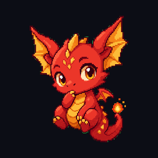
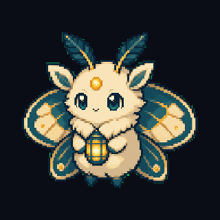

# Clawpals

<p align="center">
  <strong>A pixel-art desktop companion for OpenClaw.</strong><br/>
  Give your agent a visible body on the desktop and watch what it is doing in real time.
</p>

<p align="center">
  <a href="https://github.com/fighterz8/clawpals/releases/latest">Latest Release</a>
  ·
  <a href="https://github.com/fighterz8/clawpals/actions/workflows/desktop-build.yml">Build Workflow</a>
  ·
  <a href="docs/roadmap.md">Roadmap</a>
  ·
  <a href="docs/windows-signing.md">Windows Signing</a>
</p>

<p align="center">
  
  
  
  
</p>

> [!IMPORTANT]
> **Clawpals is still early.** The desktop app, pairing flow, live daemon reactivity, animated bundles, and local-only avatar pipeline are working, but the product is still evolving quickly.
>
> - **Bring your own OpenClaw.** Clawpals is not a hosted assistant.
> - **Cross-machine setups are currently Tailscale-first.**
> - **Windows release signing is in progress.** Stable release links exist now; a proper artifact-signing certificate rollout is underway.
> - **Custom avatar generation still needs QA.** The new coherency pipeline helps, but generation/repair quality is not yet perfect.

## Demo

<div align="center">
  <table>
    <tr>
      <td align="center" valign="top">
        
        <div><strong>Dawn Ashgold</strong></div>
        <div><sub>Reading your message…</sub></div>
      </td>
      <td width="36"></td>
      <td align="center" valign="top">
        
        <div><strong>Lantern Moth</strong></div>
        <div><sub>Focused on the current task…</sub></div>
      </td>
    </tr>
  </table>
</div>

Clawpals is meant to feel ambient, not noisy: glanceable status, tiny emotions, and just enough presence to know your assistant is alive and working.

## Why this exists

Most assistants live in chat. When they are working on something, you are often just waiting.

Clawpals gives OpenClaw a small desktop body so you can tell, at a glance, whether it is:
- idle
- thinking
- focused
- happy
- alert
- sleepy

The goal is not to make a dashboard. The goal is to make your agent feel present without turning your desktop into spam.

## What Clawpals actually is

Clawpals has three main parts:

1. **A native desktop app** built with Tauri.
2. **A local runtime** that owns current avatar state and pairing/auth.
3. **An OpenClaw skill + daemon** that mirrors real OpenClaw activity into the runtime.

That means:
- the avatar lives on the machine you look at
- OpenClaw can run locally or on another machine
- pairing happens once
- ongoing avatar control can be driven from OpenClaw

## Feature highlights

- native desktop app with tray controls
- local-first runtime and token-based pairing
- helper window for setup, diagnostics, and verification
- transparent overlay with live status light
- daemon-driven reactivity with near-zero token cost
- animated avatar bundles with per-state frame loops
- runtime avatar switching from OpenClaw
- local-only avatar generation/build/push pipeline
- deterministic avatar animation baseline from six state anchors
- coherency QA, post-build artifacts, and targeted frame repair flow
- mock provider + provider interface for future image-generation backends

## Downloads

### Stable release downloads

Download the latest packaged app here:
- <https://github.com/fighterz8/clawpals/releases/latest>

Tagged builds (`v*`) publish desktop installers/packages to GitHub Releases automatically.

### Package formats

- **Windows:** `.msi` and `.exe`
- **macOS:** `.dmg` and `.app`
- **Linux:** `.AppImage`, `.deb`, and `.rpm`

> [!TIP]
> On **Windows**, start with the **`.msi` installer** first. Use the `.exe` build only if you specifically want that package format.

> [!WARNING]
> Windows signing is being rolled out. Stable release links are live now, but fully trusted signed artifacts depend on the certificate setup documented in [`docs/windows-signing.md`](docs/windows-signing.md).

### What you are downloading

The desktop app is not just a skin. It:
- creates the tray icon and overlay
- starts the local runtime
- shows the pair code when needed
- provides the helper window for verification and diagnostics
- gives OpenClaw a real local target to pair with and control

Without the desktop app running on the display machine, OpenClaw has nothing to connect to.

## Quickstart

### Requirements

- Node.js 20+
- git
- Rust + platform build tools for Tauri
- Tailscale for most cross-machine setups

### Install

```bash
# macOS / Linux
curl -fsSL https://raw.githubusercontent.com/fighterz8/clawpals/main/scripts/install-unix.sh | bash
```

```powershell
# Windows PowerShell
irm https://raw.githubusercontent.com/fighterz8/clawpals/main/scripts/install-windows.ps1 | iex
```

### Run from source

Run these from the cloned repo directory that contains `package.json`:

```bash
cd ~/clawpals
npm ci
npm run desktop:dev
```

`clawpals` is the pairing/control CLI, not an npm-script wrapper. Use `npm run desktop:dev`, not `clawpals run desktop:dev`.

If `npm` reports `Could not read package.json`, you are in the wrong directory. `cd ~/clawpals` or re-run the installer.

If Tauri reports `failed to run 'cargo metadata' ... No such file or directory`, Rust/Cargo is missing from this shell. Install Rust, then reopen the terminal or source Cargo's env file:

```bash
curl --proto '=https' --tlsv1.2 -sSf https://sh.rustup.rs | sh -s -- -y --default-toolchain stable
source "$HOME/.cargo/env"
```

On macOS, also install Apple command line tools if prompted:

```bash
xcode-select --install
```

The current desktop app path starts the local runtime from the app.

For older/dev runtime testing:

```bash
CLAWPALS_USE_NODE_RUNTIME=1 npm run desktop:dev
```

Or directly:

```bash
npm run runtime:dev
```

## Pairing flow

Clawpals is designed to feel more like pairing a local media device than hand-editing config files.

### Typical flow

1. Open Clawpals on the display machine.
2. If it needs pairing, click **Show pair code**.
3. Give that code and host to OpenClaw.
4. OpenClaw claims the code, stores the token, and verifies the runtime.
5. The helper window shows **Connected — helper ready**.

### Example command from OpenClaw

```bash
clawpals wizard openclaw --code 472091 --host <desktop-host>.<tailnet>.ts.net:8737
```

Manual equivalent:

```bash
clawpals pair --code 472091 --host <desktop-host>.<tailnet>.ts.net:8737
clawpals activity balanced
clawpals heartbeat-reactions off
clawpals daemon enable
```

### Verify pairing

```bash
clawpals status
clawpals send happy "It works" --bubble "Hello! 🐲"
```

> [!NOTE]
> This README intentionally uses placeholders like `<desktop-host>` and `<tailnet>` instead of real machine names.

## Day-to-day behavior

The preferred path is the daemon. It tails OpenClaw session JSONL and mirrors real activity with zero model calls.

```bash
clawpals daemon enable
clawpals daemon status
clawpals daemon stop
clawpals daemon disable
```

Typical mappings:
- prompt received → `thinking`
- file reads / inspection → `thinking`
- commands / tools / long tasks → `focused`
- success / completion → `happy`
- blocker / failure → `alert`

LLM-triggered flavor emits still exist:

```bash
clawpals react <event>
clawpals send <state> [message] --bubble <text>
```

## Activity levels

Clawpals behavior is gated by a persisted activity setting so the assistant cannot casually over-animate or over-message past the user’s chosen level.

Levels:
- `off`
- `minimal`
- `balanced`
- `expressive`
- `maximum`

Example:

```bash
clawpals activity expressive
clawpals heartbeat-reactions on
```

## Privacy, security, and scope

### Privacy posture

- Clawpals is designed to be **local-first**.
- There is **no required cloud relay** for the core product.
- Cross-machine projection is currently **Tailscale-first**.
- Tokens are persisted locally after pairing.

### Security model

- loopback access is trusted for the local overlay
- non-loopback access requires auth except for narrow pairing/health routes
- pairing is short-lived and rate-limited
- token rotation is supported

### Scope disclaimer

Clawpals is not trying to be:
- an always-on surveillance tool
- a cloud-dependent status product
- a replacement for OpenClaw itself

It is the body, not the whole brain.

## Avatar system

Built-in showcase/demo bundles currently include:
- `dawn-v2-ember`
- `dawn-v2-amethyst`
- `dawn-v2-ashgold`
- `lantern-moth-v0`

These exist to show:
1. animated bundle playback
2. runtime avatar switching
3. both family variants and distinct character identities

## Local-only avatar generation pipeline

Clawpals now supports a stronger OpenClaw-side avatar workflow:
- scaffold a versioned avatar job contract
- generate or collect six state anchors
- animate frame loops deterministically
- build a portable bundle locally
- run source and post-build coherency QA
- emit review artifacts such as contact sheets and preview GIFs
- repair only failed frames
- push the finished bundle to the paired runtime

This keeps custom avatar work off the display machine and makes iteration much more agent-friendly.

Current status:
- **Stable baseline:** manual/local anchors, mock provider, deterministic animation, preserve-canvas/anchor-locked registration, post-build QA, contact sheets, targeted repair plumbing, and skill CLI wrappers.
- **Experimental:** sprite-sheet slicing.
- **Not yet implemented:** real provider-backed image generation/semantic repair. Preferred future providers are OpenAI `gpt-image-2` and Gemini `gemini-3.1-flash-image-preview`.

See:
- [`docs/v0.6.0-avatar-pipeline-release-notes.md`](docs/v0.6.0-avatar-pipeline-release-notes.md)
- [`docs/pipeline/avatar-generation-reliability-build-spec.md`](docs/pipeline/avatar-generation-reliability-build-spec.md)
- [`docs/pipeline/avatar-generation-pipeline.md`](docs/pipeline/avatar-generation-pipeline.md)
- [`docs/pipeline/avatar-coherency-qa.md`](docs/pipeline/avatar-coherency-qa.md)
- [`docs/pipeline/avatar-vision-qa-rubric.md`](docs/pipeline/avatar-vision-qa-rubric.md)
- [`docs/clawpals-style-guide.md`](docs/clawpals-style-guide.md)

> [!CAUTION]
> Generated avatars are still an active R&D area. The pipeline mechanics are now much stronger, but polished avatar quality still depends on future real provider integration and calibrated repair/vision QA.

## Architecture

```text
OpenClaw host                         Display machine
─────────────                         ───────────────
session JSONL ── daemon/CLI ──HTTP──▶ Tauri app/runtime
                                      helper + overlay
                                      tray + token store
```

### Auth summary

Public routes:
- `/health`
- `/pair-mode`
- active `/pair/claim`

Authenticated routes:
- state changes
- avatar pushes
- token rotation
- auth check

Tokens persist on both sides after successful pairing.

## Status

### Working now

- native helper/setup surface
- native runtime
- transparent overlay
- tray controls
- visible connection status light
- 6-digit pairing
- persisted reconnect token
- daemon-driven reactions
- Tailscale-first cross-machine setup
- runtime avatar push/select
- animated showcase bundles
- local-only avatar generation/build/push flow
- deterministic animation from six state anchors
- post-build coherency QA, contact sheets, vision QA mock path, and targeted repair hooks
- stable GitHub Release download path

### In progress

- Windows signing rollout
- smoother animation quality
- real OpenAI/Gemini provider-backed avatar generation and semantic repair
- stronger automatic avatar coherency repair
- richer helper controls
- better daemon inference and more descriptive updates

### Not yet

- polished cross-agent support beyond OpenClaw
- hosted relay path for users without Tailscale
- environment/screen awareness
- calibrated production-quality provider-backed avatar generation and repair

## Documentation

- [`docs/v0.6.0-avatar-pipeline-release-notes.md`](docs/v0.6.0-avatar-pipeline-release-notes.md)
- [`docs/v0.5-brief.md`](docs/v0.5-brief.md)
- [`docs/clawpals-style-guide.md`](docs/clawpals-style-guide.md)
- [`docs/avatar-bundle-spec.md`](docs/avatar-bundle-spec.md)
- [`docs/avatar-event-contract.md`](docs/avatar-event-contract.md)
- [`docs/pipeline/avatar-generation-pipeline.md`](docs/pipeline/avatar-generation-pipeline.md)
- [`docs/pipeline/avatar-coherency-qa.md`](docs/pipeline/avatar-coherency-qa.md)
- [`docs/windows-signing.md`](docs/windows-signing.md)
- [`docs/roadmap.md`](docs/roadmap.md)
- [`docs/adr/`](docs/adr/)

## Honest about the project

Clawpals is a portfolio piece, a personal tool, and a product experiment.

The hard part has not been the tray icon or the HTTP routes. The hard part has been making generated characters feel like one coherent little creature instead of several almost-matching redraws. That is still where a lot of the project’s ambition lives.

If you are building something similar, do not underestimate the asset pipeline.

## License

Source: MIT.

Avatar bundle licensing/details: see each bundle's `avatar.json`.
